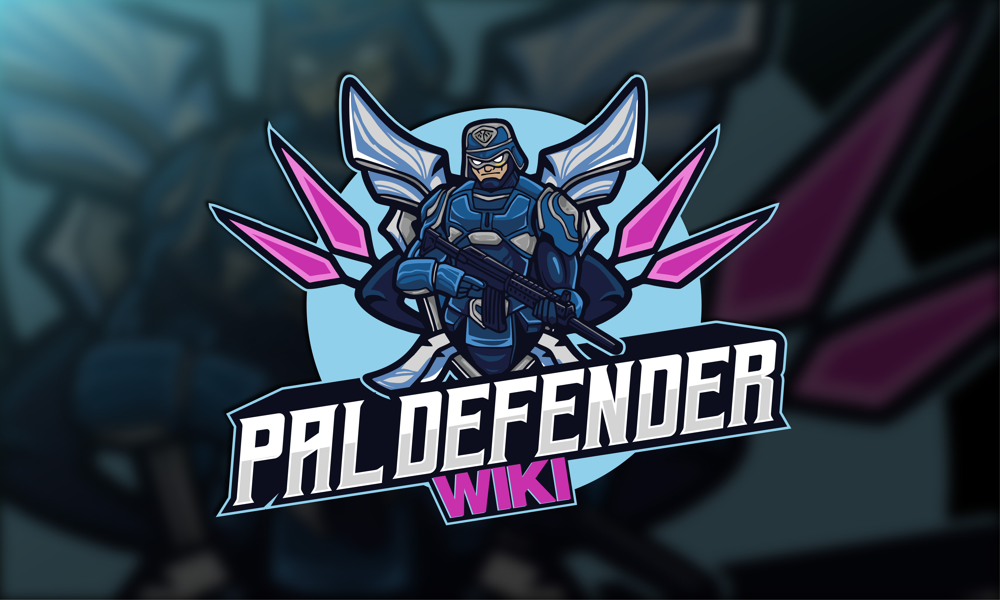

# Startseite

  

  <form action="https://www.paypal.com/donate" method="post" target="_top" style="margin:0;">
    

      

      
      
    

  </form>

---

## Vorwort
Wir freuen uns, wenn du zum Wiki beiträgst oder Fehler meldest, damit das Wiki Schritt für Schritt besser wird.

Der Code ist Closed Source und wir planen derzeit keine Veröffentlichung.

---

## Über PalDefender

PalDefender implementiert umfassende serverseitige Prüfungen, um viele bekannte und auch noch unbekannte Cheats, Exploits und Abstürze zu verhindern. Bevor eine Spieleraktion ausgeführt wird, prüft PalDefender auf mögliches Cheat-Verhalten. Je nach Serverkonfiguration werden Spieler bei solchen Aktionen gewarnt, gekickt, gebannt oder per IP gebannt. Aktuell ist PalDefender für Windows-basierte Dedicated Server verfügbar.

**Erfahrene Linux-Entwickler sind herzlich eingeladen, uns zu unterstützen.**

---

## Autoren

- <a href="https://github.com/Zvendson" target="_blank">Zvendson</a> (Aktueller Maintainer)
- <a href="https://github.com/Ultimeit" target="_blank">Ultimeit</a> (Ursprünglicher Ersteller)
---

## Danksagung

- <a href="https://www.pocketpair.jp/palworld" target="_blank">Pocketpair, Inc.</a>
- <a href="https://www.unrealengine.com" target="_blank">Unreal Engine</a> - Epic Games

---

## Schlusswort

私たちは、<a href="https://www.pocketpair.jp/palworld" target="_blank">Pocketpair, Inc.</a>による素晴らしい仕事に感謝の意を表したいと思います。色鮮やかな世界や、パルとのダイナミックなインタラクション、そして創造的なデザインは、チームの献身と情熱を見事に表しています。コミュニティの一員として、私たちはPalServer向けのプラグインを開発し、セキュリティを強化し、潜在的な悪用から守ることでPalworldをサポートしています

私たちは今後も、Palworldサーバーに最高水準のセキュリティと保護を提供できるよう努め続けます。皆様からのフィードバックは非常に貴重で、心から感謝しています。 
~ <a href="https://github.com/Zvendson" target="_blank">Zvend</a>

> *Wir möchten <a href="https://www.pocketpair.jp/palworld" target="_blank">Pocketpair, Inc.</a> für ihre großartige Arbeit an Palworld danken. Die lebendige Welt, die dynamischen Interaktionen mit Pals und das kreative Design zeigen die Hingabe und Leidenschaft des Teams. Als Community unterstützen wir Palworld ebenfalls, indem wir ein Plugin für den PalServer entwickeln, das die Sicherheit verbessert und vor möglichen Exploits schützt.*
  
*We will continue striving to provide the highest level of security and protection for your Palworld server. Your feedback is invaluable, and we truly appreciate it.*
