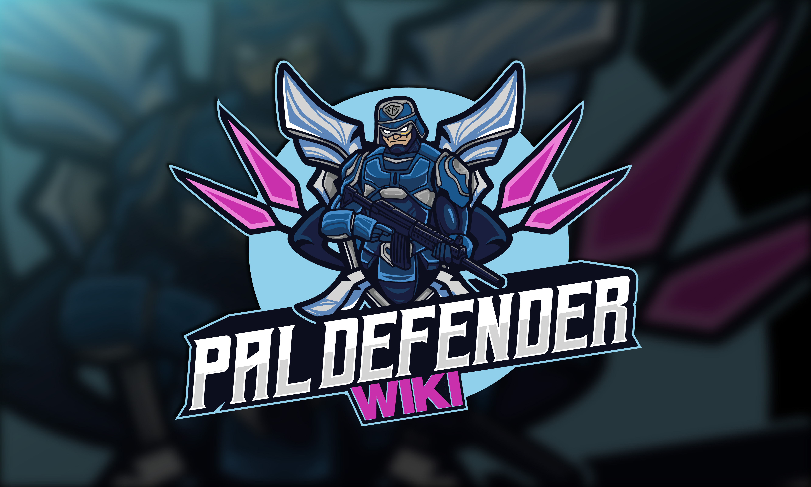

# Startseite

  

  <form action="https://www.paypal.com/donate" method="post" target="_top" style="margin:0;">
    

      

      
      
    

  </form>

---

## Vorwort
Dieses Wiki befindet sich derzeit im Aufbau und ist daher noch unvollständig. Wir würden uns freuen, wenn du Beiträge leistest oder auf Fehler hinweist, damit das Wiki Schritt für Schritt weiter wachsen kann.

Der Quellcode ist **Closed Source** und es gibt derzeit **keine Pläne**, ihn zu veröffentlichen.

---

## Über PalDefender

PalDefender implementiert umfassende serverseitige Prüfmechanismen, um eine Vielzahl bekannter sowie bislang unbekannter Cheats, Exploits und Abstürze zu verhindern. Bevor eine Spieleraktion ausgeführt wird, prüft PalDefender diese auf potenziell verdächtiges oder manipulatives Verhalten.

Abhängig von der Serverkonfiguration werden Spieler bei solchen Aktionen verwarnt, gekickt, gebannt oder IP-gesperrt. Diese Funktion befindet sich aktuell in der **Beta-Phase** und ist derzeit **ausschließlich für Windows-basierte Dedicated Server** verfügbar.

**Erfahrene Linux-Entwickler sind ausdrücklich eingeladen, uns zu unterstützen.**

---

## Autor(en)

- <a href="https://github.com/Zvendson" target="_blank">Zvendson</a> (Derzeitiger Programmierer & Projektbetreuer)
- <a href="https://github.com/Ultimeit" target="_blank">Ultimeit</a> (Ursprünglicher Entwickler)

---

## Credits

- <a href="https://www.pocketpair.jp/palworld" target="_blank">Pocketpair, Inc.</a>
- <a href="https://www.unrealengine.com" target="_blank">Unreal Engine</a> – Epic Games

---

## Nachwort

私たちは、<a href="https://www.pocketpair.jp/palworld" target="_blank">Pocketpair, Inc.</a>による素晴らしい仕事に感謝の意を表したいと思います。色鮮やかな世界や、パルとのダイナミックなインタラクション、そして創造的なデザインは、チームの献身と情熱を見事に表しています。コミュニティの一員として、私たちはPalServer向けのプラグインを開発し、セキュリティを強化し、潜在的な悪用から守ることでPalworldをサポートしています

私たちは今後も、Palworldサーバーに最高水準のセキュリティと保護を提供できるよう努め続けます。皆様からのフィードバックは非常に貴重で、心から感謝しています。 
~ <a href="https://github.com/Zvendson" target="_blank">Zvend</a>

> *Wir möchten <a href="https://www.pocketpair.jp/palworld" target="_blank">Pocketpair, Inc.</a> für ihre beeindruckende Arbeit an Palworld danken. Die lebendige Welt, die dynamischen Interaktionen mit den Pals und das kreative Design zeigen die Hingabe und Leidenschaft des Teams. Als Community arbeiten wir daran, Palworld zu unterstützen, indem wir ein Plugin für den PalServer entwickeln, das die Sicherheit erhöht und vor möglichen Exploits schützt.*
>
> *Wir werden weiterhin danach streben, das höchstmögliche Sicherheits- und Schutzniveau für euren Palworld-Server zu gewährleisten. Euer Feedback ist für uns unverzichtbar und wir danken euch herzlich dafür.*
