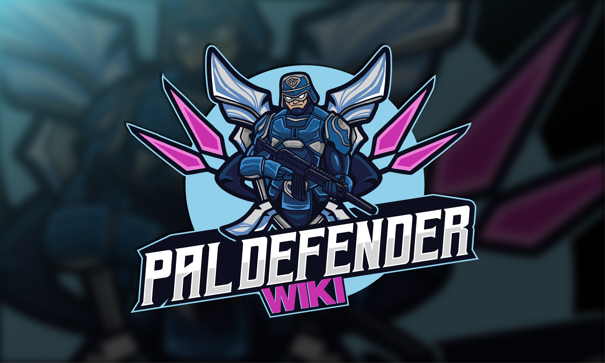

# Home

  

  <form action="https://www.paypal.com/donate" method="post" target="_top" style="margin:0;">
    

      

      
      
    

  </form>

---

## Foreword
The Wiki is currently under construction and therefor incomplete. We would appreciate if you contribute or point out mistakes, so the Wiki slowly and steady fills up.

The code is closed source and we dont have any plans to release it.

---

## About

PalDefender implements comprehensive server-side validation to prevent a wide range of known and some yet undiscovered cheats, exploits, and crashes. Before executing any player action, PalDefender checks for potential cheating behavior. Depending on the server's configuration, players attempting such actions are warned, kicked, banned, or IP banned. Currently, this feature is in beta and is available exclusively for Windows-based dedicated servers.

**Any experienced Linux dev is welcome to help us out.**

---

## Authors

- <a href="https://github.com/Zvendson" target="_blank">Zvendson</a> (Current Maintainer)
- <a href="https://github.com/Ultimeit" target="_blank">Ultimeit</a> (Original Creator)
---

## Credits

- <a href="https://www.pocketpair.jp/palworld" target="_blank">Pocketpair, Inc.</a>
- <a href="https://www.unrealengine.com" target="_blank">Unreal Engine</a> - Epic Games

---

## Afterwords

私たちは、<a href="https://www.pocketpair.jp/palworld" target="_blank">Pocketpair, Inc.</a>による素晴らしい仕事に感謝の意を表したいと思います。色鮮やかな世界や、パルとのダイナミックなインタラクション、そして創造的なデザインは、チームの献身と情熱を見事に表しています。コミュニティの一員として、私たちはPalServer向けのプラグインを開発し、セキュリティを強化し、潜在的な悪用から守ることでPalworldをサポートしています

私たちは今後も、Palworldサーバーに最高水準のセキュリティと保護を提供できるよう努め続けます。皆様からのフィードバックは非常に貴重で、心から感謝しています。 
~ <a href="https://github.com/Zvendson" target="_blank">Zvend</a>

> *We want to express our gratitude to <a href="https://www.pocketpair.jp/palworld" target="_blank">Pocketpair, Inc.</a> for their incredible work on Palworld. The vibrant world, dynamic interactions with Pals, and creative design showcase the team's dedication and passion. As a community, we are also working to support Palworld by developing a plugin for the PalServer that enhances security and protects it from potential exploits.*
  
*We will continue striving to provide the highest level of security and protection for your Palworld server. Your feedback is invaluable, and we truly appreciate it.*
